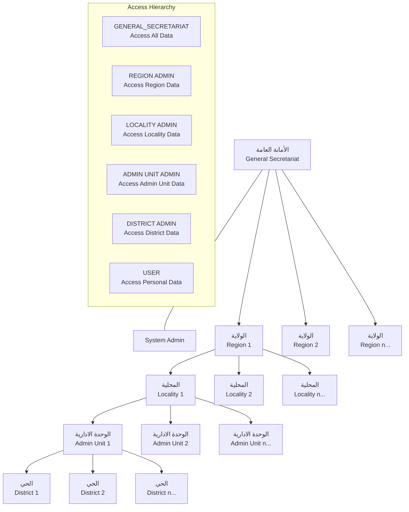

# Hierarchical Structure Visualization

The following diagram illustrates the administrative hierarchy structure and access model:

## Key Points

1. **الأمانة العامة (General Secretariat)** sits at the top level and has visibility across all administrative levels
2. **الولاية (Region)** is the top geographic division
3. **المحلية (Locality)** is contained within a Region
4. **الوحدة الادارية (Administrative Unit)** is contained within a Locality
5. **الحي (District)** is the lowest level division contained within an Administrative Unit
6. Users at each level have access to their own level and all levels below them in the hierarchy
7. Regular users are associated with a specific district and can only access their personal data

## Data Access Pattern

- Users with GENERAL_SECRETARIAT role can view all data
- Users with REGION role can view data for their region and all its sub-levels
- Users with LOCALITY role can view data for their locality and all its sub-levels
- Users with ADMIN_UNIT role can view data for their administrative unit and all its sub-levels
- Users with DISTRICT role can view data for their district only
- Regular users can only access their personal data

## Implementation Notes

The hierarchical structure is implemented in the database schema with foreign key relationships between the levels, and the authorization system checks these relationships when determining access permissions.
